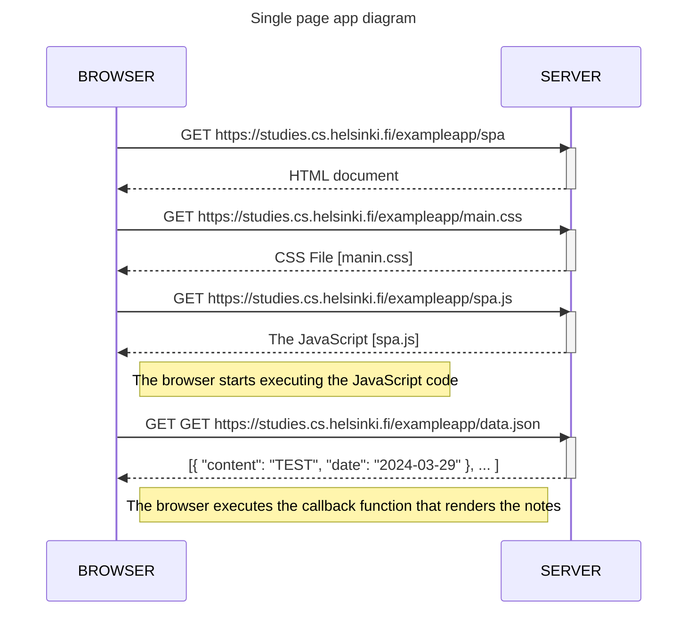

# Exercises 0.5: SPA Diagram 

```mermaid
sequenceDiagram
    Title: Single page app diagram

    participant BROWSER
    participant SERVER

    BROWSER->>SERVER: GET https://studies.cs.helsinki.fi/exampleapp/spa
    activate SERVER

     SERVER-->>BROWSER: HTML document
    deactivate SERVER

    BROWSER->>SERVER: GET https://studies.cs.helsinki.fi/exampleapp/main.css
    activate SERVER

    SERVER-->>BROWSER: CSS File [manin.css]
    deactivate SERVER

    BROWSER->>SERVER: GET https://studies.cs.helsinki.fi/exampleapp/spa.js
    activate SERVER

    SERVER-->>BROWSER: The JavaScript [spa.js]
    deactivate SERVER

     Note right of BROWSER: The browser starts executing the JavaScript code 

    BROWSER->>SERVER: GET GET https://studies.cs.helsinki.fi/exampleapp/data.json
    activate SERVER

    SERVER-->>BROWSER: [{ "content": "TEST", "date": "2024-03-29" }, ... ]
    deactivate SERVER

    Note right of BROWSER: The browser executes the callback function that renders the notes
```